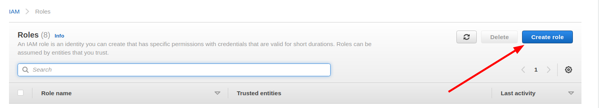
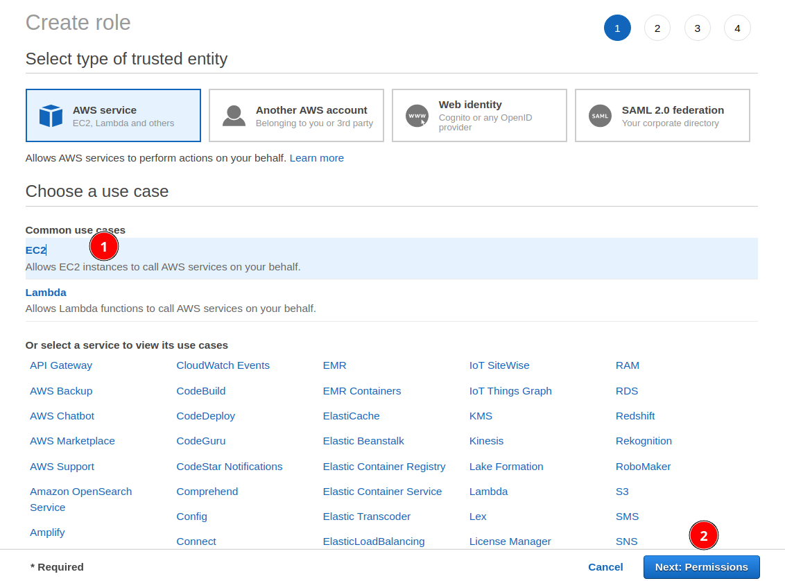
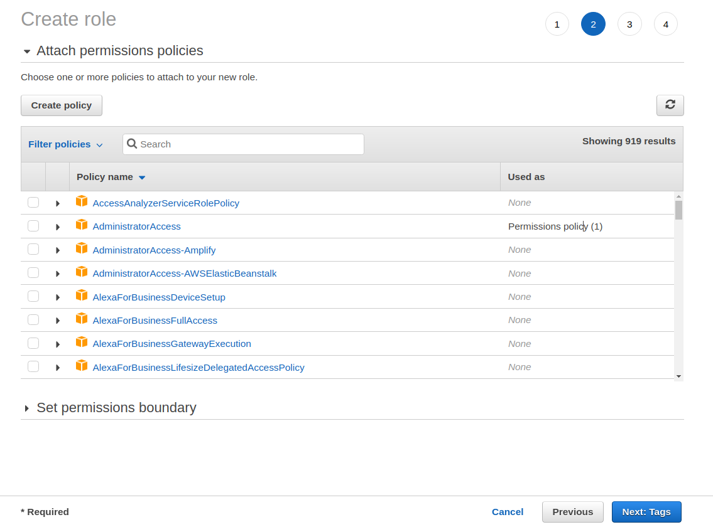
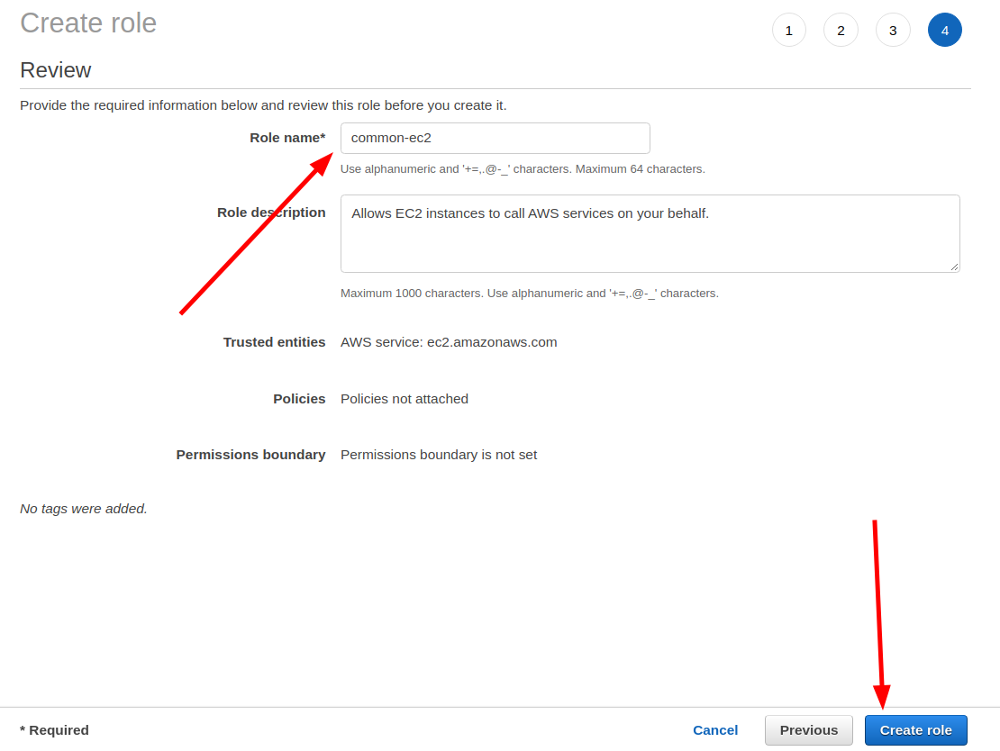

# Создание IAM роли для EC2

## Зачем это надо?

IAM роли нужны для разделения уровней доступа к различным ресурсам на Amazon AWS. Например, вы можете захотеть управлять AWS с помощью кода. Тогда будет логично для read-only операций создать IAM роль, у которой есть доступ только на чтение.

## Создание роли

Нажмите Create role:

Amazon должен предложить настроить будущую роль.

На первой странице в разделе Common cases выберите EC2 и перейдите к настройкам Permissions:

На странице с Permissions необходимо выбрать уровни доступа, которые есть у будущей роли. 

Если вы пока что не планируете пользоваться IAM ролями, можно ничего не указывать и перейти на следующую страницу:

На странице с тегами тоже можно ничего не добавлять. Ознакомиться с предназначением тегов можно [здесь](https://docs.aws.amazon.com/IAM/latest/UserGuide/id_tags.html):

> A tag is a custom attribute label that you can assign to an AWS resource. 
> Tags help you identify and organize your AWS resources.

На следующей странице укажите название и создайте новую роль:

Теперь можно вернуться на страницу создания EC2-инстанса, нажать Refresh рядом со списком ролей и сделать выбор.