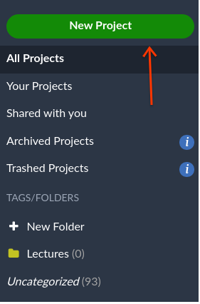
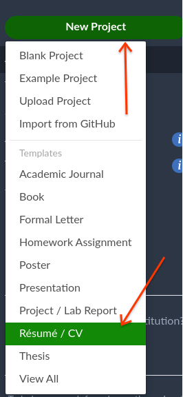
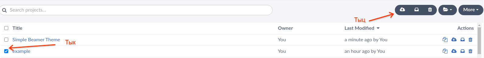
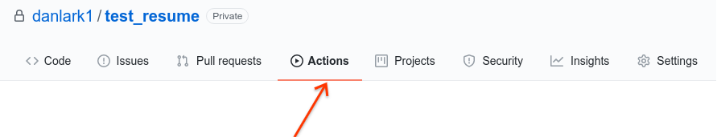
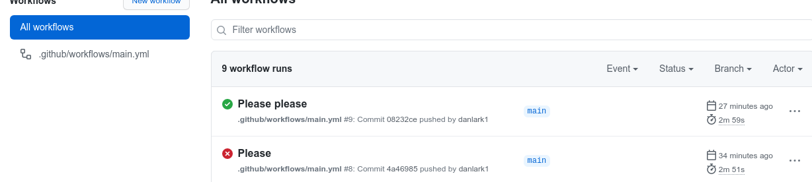
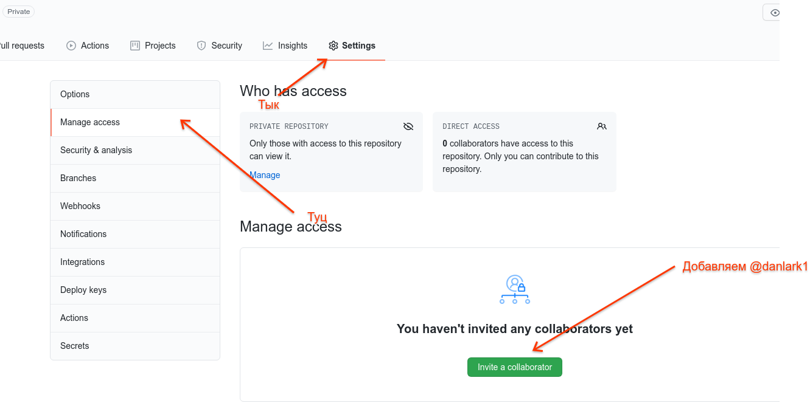
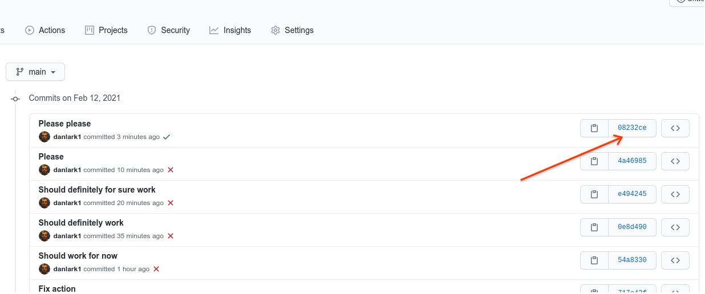

# Выкладываем резюме в LaTeX с помощью Docker и Github Actions

Ваша задача заключается в том, чтобы написать своё резюме с помощью LaTeX,
заполнить его для стажировок и вообще будущего. Уметь воспроизводить результаты
с помощью Docker и настроить CI систему, чтобы при обновлении Вашего резюме
пересобиралась финальная pdf.

## Пишем резюме в LaTeX

Шаги действия.

* Посмотреть и [прочитать](../../layout_systems) лекцию про Markdown и LaTeX
* Зарегистрироваться на Overleaf
* Слева сверху после регистрации будет зелёная кнопка `New Project`

<p align="center">
  
</p>

* Нажимаем на неё

<p align="center">
  
</p>

* Дальше перед Вами будут сотни шаблонов для написания резюме. Выбирайте любой,
  который нравится
* Заполняйте информацию про себя, прям в Overleaf можно всё менять и заполнять.
  Вам в любом случае придётся это делать
* Как только всё сделали, скачайте весь архив

<p align="center">
  
</p>

* Вы можете забить на инструкцию и сделать всё самим, я лишь показал где можно
  взять хорошие проверенные временем шаблоны

## Собираем на Linux

* Обязательно надо [посмотреть](https://youtu.be/H3Kqcvzxlac) и прочитать
  (если лектор всё таки записал) лекцию про Docker и виртуализацию.
* Создайте отдельную папку куда вы выложите весь архив со всеми файлами для
  резюме
* Установите Docker (сами)
* Создайте `Dockerfile`
* Dockerfile должен состоять из системы, установки зависимостей, копирования
  нужных файлов или папки и сборки. Как примерно он должен быть устроен,
  смотрите по [таймкоду записи лекции](https://youtu.be/H3Kqcvzxlac?t=1528).
  Также можете посмотреть [guide](https://docs.docker.com/engine/reference/builder/).
* Чтобы узнать, на какую систему Вам надо собирать, запустите скрипт
  [choose_system.py](./choose_system.py), где Вы переменную `name` заменяете
  на своё ФИО. Измененный файл включите в будущий github репозиторий.
* Для установки pdflatex, чтобы собирать pdf файлы с Вашими резюме необходимы
  следующие пакеты:
  * `texlive-fonts-recommended` (для шрифтов)
  * `texlive-generic-recommended` (обычный пакет)
  * `texlive-latex-extra` (для доп возможностей как параграфы и сложная математика)
  * `texlive-fonts-extra` (для больше шрифтов)
  * `dvipng` (для картинок .dvi формата)
  * `texlive-latex-recommended` (для установки макропакета LaTeX)
  * `texlive-base` (что-то ещё, без чего не собирается)
  * `texlive-pictures` (больше картинок)
  * `texlive-lang-cyrillic` (для русского языка)
  * `texlive-science` (для ещё больше математики)
  * `cm-super` (для системных шрифтов)
  * `texlive-generic-extra` (обычный дополнительный пакет, иногда требуется)

  **Если возникают сложности с Fedora, можете поставить `texlive-scheme-full`.**

  Вы можете добавлять свои пакеты, если они Вам нужны, ну или если я что-то
  забыл и что-то не работает на каком-то линуксе.
* Чтобы разобраться с образами, контейнерами стоит использовать следующие команды
  * `# docker build --tag $YOUR_TAG -f Dockerfile .` Для сбора и выставления тега
  * `# docker run -it $YOUR_TAG /bin/bash`. Для создания контейнера для запуска
    shell с образом `$YOUR_TAG`
  * `# docker images` для просмотра всех образов
  * `# docker ps -a` для просмотра всех контейнеров
  * `# docker cp $CONTAINER_ID:/path/to/file /path/to/local`
  * `# docker start $CONTAINER_ID`
  * `# docker attach $CONTAINER_ID`
  * `# docker stop $CONTAINER_ID`
  * `# docker rm $CONTAINER_ID`
    * `# docker stop $(docker ps -a -q)` для остановки всех
    * `# docker rm $(docker ps -a -q)` для удаления всех
  * `# docker rmi $IMAGE_ID`
  * `# docker images prune` для удаления всех образов, которые не используются
* Запустите pdflatex на Ваш главный .tex файл (обычно это `main.tex`) и
  убедитесь, что pdf, которая получилась, соответствует Вашим ожиданиям. А если
  нет, правьте, чтобы соответствовало. **Убедитесь, что Вы запускаете pdflatex с аргументом `-interaction=nonstopmode`**
* Используйте `ENTRYPOINT` или `CMD` с bash скриптом, который собирает Ваше
  резюме, а возможно что-то и ещё делает, например, подчищает логи или
  что-то архивирует.

## Публикуем через CI

* Обязательно зарегистрируетесь на Github
* [Создайте](https://github.com/new) новый **приватный** репозиторий
* Не дай бог Вы положите туда `.zip` архив. Кладите туда файлы с Вашего архива
  резюме, желательно в отдельную папку.
* Положите в корень репозитория так же Dockerfile и README.md.
* Прочитайте про [Github Actions](https://docs.github.com/en/actions) и
  [Docker Github Actions](https://docs.github.com/en/actions/creating-actions/creating-a-docker-container-action)
* Сделайте `README.md`, где Вы обязаны указать своё ФИО и группу. Можете ещё
  пасхалок там наделать, если хочется :)
* Умно назовите все секции во всех рецептах, см гайд выше
* Сделайте себе `action.yml`. Закоммититьте код
* Сделайте себе `.github/workflows/main.yml`, закоммитьте код

Зайдите в Actions:

<p align="center">
  
</p>

Вы увидите, что сборка должна была начаться и финальная pdf должна была быть получена.

<p align="center">
  
</p>

**Коммитить саму pdf в репозиторий не надо, CI лишь проверяет, что TeX файл
корректный и его можно собрать, но если хотите, можете добавить pdf из собранного
контейнера себе в репозиторий**

* В итоге структура файлов должна быть примерно такой:

```
├── choose_system.py
├── action.yml
├── Dockerfile
├── .github
│   └── workflows
│       └── main.yml
├── CV
│   ├── main.tex
│   ├── some_other.sty
│   ├── ...
|   ├── ...
|   └── ...
└── README.md
```

* Если всё собралось с первого раза, поломайте свою сборку и
  убедитесь, что оно реально поломалось
* Почините и закоммитьте правильную версию
* Убедитесь, что на github в истории Ваших коммитов стоит зелёная галочка :)

## Сдача

* Добавьте меня как collaborator в Ваш репозиторий


<p align="center">
  
</p>

* Вы должны прислать ссылку на коммит, а не на репозиторий, потому что
  коммиты подделать очень сложно. Для этого вы должны зайти в свою историю
  коммитов на репозитории

<p align="center">
  
</p>

И прислать ссылку на свой коммит как внизу

<p align="center">
  
</p>

* Сдать эту ссылку в [форму](https://forms.gle/W2qgkRc6dJSLVN458).

# Оценка

4 балла за выкладывание своего резюме в приватный репозиторий в github,
3 балла за Dockerfile, 3 балла за настройку Github Actions.

После проверки можно будет опубликовать репозиторий, если сильно хочется.

# Дедлайн

17 марта 2021 года 23:59:59 MSK. Если Вы хотите получить полноценный фидбек по содержанию, надо сдать до 10 марта 23:59:59 MSK.

# У меня ничего не работает

Спрашивайте в нашем [чате](https://t.me/joinchat/S7uq0gezA-J6h3dg).

# Так, я всё продолбал, осталось два дня до дедлайна

Ставлю, что за два дня с нулём знаний Вы это не сделаете на полный балл
¯\\\_(ツ)\_/¯.
