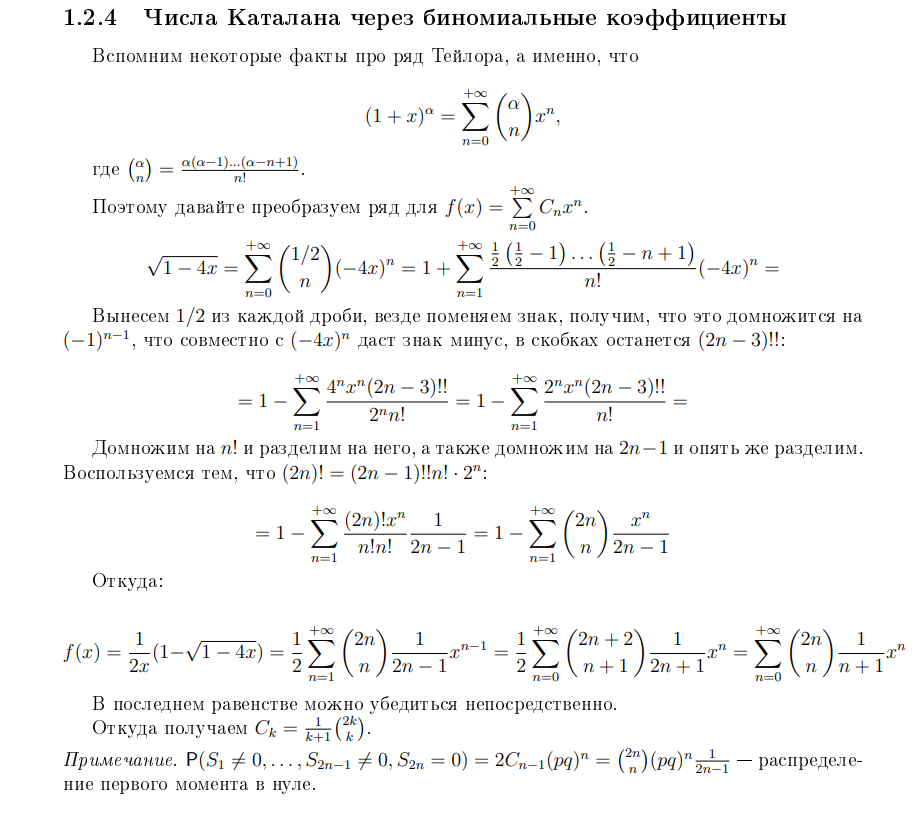
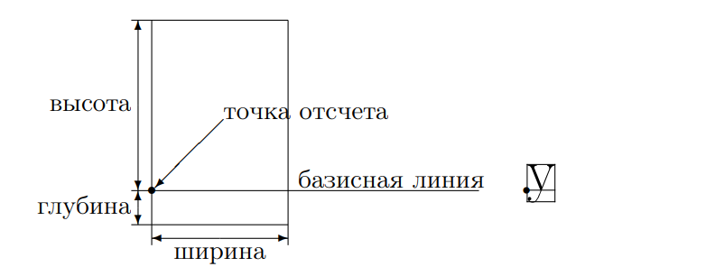
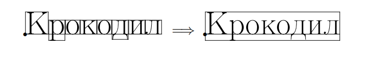

# Markdown, LaTeX

В сегодняшней лекции поговорим о том, как оформлять Ваши результаты, чтобы Вам
самим это нравилось. Для этого есть много систем, например, скорее всего
самая популярная для Вас была Microsoft Word, в которой Вы правили исходники и
интерфейс там по большой части графический. Хоть Вы и могли быть удовлетворены
результатом, но скорее всего Вы не сможете добиться легко вот такого результата,
который возможно Вы даже уже видели в статьях, листочках и математических
книжках:

<p align="center">
  
</p>

В целом для типографной математики и около математических дисциплин (в том
числе и Computer Science) Word очень сложен и практически невозможен для
поддержки, он плохо расширяется и имеет много проблем с совместимостью. Такие
редакторы называются WYSIWYG (What You See Is What You Get).

Вы всё ещё можете делать Ваши документы/отчёты в Word/LibreOffice или вообще
писать от руки, но для того, чтобы Ваши результаты выглядели эстетически
красивыми, имели возможность для портирования, существуют различные другие
решения. Со временем закрепились две системы, которые я бы назвал достаточно
полярными. Одна из них, Markdown, является чуть ли не самой простой системой
вёрстки, другая из них, LaTeX, является одной из самых сложных. По уровню
погружения я бы сказал, что LaTeX достаточно прост в написании чего-то базового,
но сложен как C++ в деталях, тонкостях и получении результата, который бы Вас
полностью удовлетворял. Обе системы были написаны программистами, Markdown был в
основном создан для упрощения написания HTML кода, но в итоге прижился больше в
документации и каких-то статических инструкциях, когда как LaTeX создавался
больше для научного сообщества, в том числе и для математиков.

# Markdown

Философия markdown заключается в том, что Вы очень хорошо понимаете, как
базовые инструкции и обычный текст преобразуются в HTML вёрстку. Фактически
поверх markdown запускается движок, который генерирует HTML и этот движок может
быть как угодно кастомизирован.

Файлы имеют расширение `.md`, стандартные для репозиториев файлы, например
`README.md`, как этот :).

## Базовые инструкции markdown в github/gitlab

* Текст пишется в параграфах, любой пробельный символ (то есть пробелы, переносы
  строк и тд) создают лишь один пробел, чтобы начать новый параграф, надо
  написать пустую строку
* Текст можно модифицировать в _italic_ (`_italic_`), **bold** (`**bold**`)
* Заголовки можно делать через несколько количество символов `#`, каждый новый
  будет создавать заголовок меньшего шрифта
* Можно вставлять ссылки: [Search for it.](http://www.google.com) как
  `[Search for it.](http://www.google.com)`
* Тоже самое с картинками, например, картинка в начале этого документа вставлена
  как `` или если хочется с модификаторами, можно
  уже писать на HTML

```
<p align="center">
  
</p>
```

* Делать цитаты

> "Да кому нужен _LaTeX_ после этого"

как

```
> "Да кому нужен _LaTeX_ после этого"
```

* Делать списки

1. A
1. B
    1. B.1
1. C
<!---
1. само пронумирует как 1, 2, 3
-->

* A
  * A.1
* B
* C

```
1. A
1. B
    1. B.1
1. C
<!---
Это комментарий
1. само пронумирует как 1, 2, 3
-->

* A
  * A.1
* B
* C
```

* Писать код с любыми языковыми тегами и подсветкой
(console, shell, cpp, python, rust, и так далее):

```cpp
int main() {
  return 0;
}
```

````
```cpp
int main() {
  return 0;
}
```
````

* Task листы

- [x] Done
- [ ] Not Done :(

```
- [x] Done
- [ ] Not Done :(
```

И ~~тысячи~~ (`~~тысячи~~`) миллион других вещей, которые можно комбинировать вместе.

Как например HTML                             | И таблички c эмодзи
--------------------------------------------- | -------------------
Оп                                            | :octocat:
<ul><li>[x] item1</li><li>[ ] item2</li></ul> | Оп :+1:

```
Как например HTML                             | И таблички c эмодзи
--------------------------------------------- | -------------------
Оп                                            | :octocat:
<ul><li>[x] item1</li><li>[ ] item2</li></ul> | Оп :+1:
```

Вы можете попрактиковаться в Markdown
[здесь](https://jbt.github.io/markdown-editor/), а всякие примеры можете взять
у меня в [репозитории](https://github.com/danlark1/miniselect), которым я горжусь,
или можете посмотреть [Awesome
Readmes](https://github.com/matiassingers/awesome-readme). Или уж на крайний
случай, заглянуть в исходники этого репозитория. В [ссылках](#Ссылки) будут
ещё примеры.

Вы можете пойти дальше, и чтобы создавать красивые презентации в Markdown, можно
использовать [marp](https://github.com/marp-team/marp-cli), это движок поверх
синтаксиса markdown, который позволяет создавать слайды в pdf/html/pptx и так
далее. Большинство людей, которые выступают на конференциях по Computer Science,
используют либо marp, либо LaTeX beamer. Стоит отметить, что marp поддерживает
нативно LaTeX, хотя обычный markdown не всегда.

<p align="center">
  
</p>

## LaTeX

Если говорить про LaTeX, то он, конечно, появился не сразу и до LaTeX печатали
на IBM машинах, оставляли место для формул и потом дописывали их руками.

<p align="center">
  
</p>

Человек, который решил поменять эту индустрию, знаком Вам скорее всего по
курсу алгоритмов и структур данных, Дональд Кнут, кто решил, что писать
книжки в таком формате безумно сложно. Его томы всё равно были написаны как и
на таких машинах, так и в его системе TeX.

TeX (произносится «тех», пишется также «TeX») представляет собой
специализированный язык программирования (Кнут не только придумал язык, но и
написал для него
транслятор, причем таким образом, что он работает совершенно одинаково на самых
разных компьютерах), на котором пишутся издательские системы, используемые на
практике. Точнее говоря, каждая издательская система на базе TeX'а представляет
собой пакет макроопределений этого языка. В частности, LaTEX
(произносится «латех» или «лэйтех», пишется также «LaTeX») &mdash; это созданная
Лесли Лэмпортом издательская система на базе TeX'а, c Лесли студенты, которые
пойдут на специализацию Распределённые Системы, ещё познакомятся. В целом можете
считать, что TeX был придуман математиком, а LaTeX больше инженерная система,
это различие и парадигму Вы будете наблюдать, если будете техать.

Огромным достоинством систем на базе TeX'а является высокое качество и
гибкость верстки абзацев и математических формул (в этом отношении TeX до сих
пор не превзойден).

В целом на Linux и MacOS Вы можете использовать pdfLaTeX, на Windows &mdash;
MikTex. Они похожи и большинство документов могут быть портированы без проблем.
Некоторые шрифты могут отличаться, но в целом они совместимы.

Простейший LaTeX файл находится в [small.tex](./small.tex). Чтобы посмотреть
шаблоны, можно стырить несколько у
[Stanford](https://web.stanford.edu/~chadj/latex2.html). Мой курс также писали в
своё время все лекции, у которых не было
конспектов в [HSE AMI Lectures](https://github.com/hse-ami/lectures). Я,
например, писал главы [теории
вероятностей](https://github.com/hse-ami/lectures/tree/master/probability-theory_16-17_2course)
пилотного потока, которые возможно кто-то из Вас уже читал. Там же можно
подсмотреть наши .sty файлы для стиля.

Как Вы уже поняли, LaTeX состоит из секций или команд, которые начинаются с
`\`, например `\documentclass{article}`, или `\title{Example}`. Секции
начинаются с `\begin`, например `\begin{document}` или `\begin{itemize}`,
которые должны заканчиваться с помощью `\end{...}`. В какой-то степени это
scope и скобки к которым мы так привыкли в программировании. Формулы пишутся
в `$...$`, а центральные большие формулы пишутся в двойных `$$...$$`. Формулы
имеют свой синтаксис, но основные понятия простые: дроби `$\frac{1}{2}$`, степени
`$x^{2}$`, индексы `$x_{2}$`, точки `$\ldots$`, знаки сравнения
`$a \leq \geq < > b$`, символы `$\alpha \omega \hat{a}$` и так далее.
Многие подсказки, как вставлять картинки и тд, символы можете найти в книжке
"LaTeX в примерах" в [pdf от проф.
Воронцова](http://www.machinelearning.ru/wiki/images/e/e4/latex_examples.pdf).

## Почему TeX такой красивый

Немного истории: TeX был написан Дональдом Кнутом финально в 1989 году и
специально не был совершествован с того времени, все изменения были багфиксами.

Тому, кто первым обнаруживал очередную ошибку, Кнут выплачивал денежную премию;
эта премия время от времени удваивалась и выросла от $ 2.56 (2^8 центов) до
$ 327.68 (2^15 центов), после чего Кнут начал новый отсчет. В любом случае
ошибок в TEX'е за все эти годы обнаружено очень немного. Может, 20 или 30 от
силы.

Начиная с версии 3.0, версии LaTeX идут по числу Пи, сейчас версия уже
3.14159265 и Кнут завещал, что после его смерти, версия должна стать Пи и
никакие изменения в TeX вноситься не должны. TeX написан на языке Web, который
транслируется в C.

Формально TeX это интерпретируемый язык программирования, все буквы, команды
это формально команды `напечатай что-то тут`. Формально LaTeX это лишь
определение тучи различных команд для TeX, чтобы было удобно ими пользоваться.

Далее шрифты, которые Вы устанавливайте, идут в .dvi описание файлов. К
счастью, dvi формат не стал универсальным между всеми системами и эту нишу
заслуженно занял формат .pdf. Для описания букв и шрифтов Кнут разработал
второе свое поделие Metafont. Сейчас шрифты
никто не пишет в Metafont и все в основном делают их в TrueType, PostScript и
OpenType.

Шрифты имеют описание и дальше TeX имеет логику выстраивания всех букв

<p align="center">
  
</p>

Когда из букв составляются слова (а из слов &mdash; строки), блоки,
соответствующие отдельным буквам, ставятся рядом так, чтобы их базисные
линии были продолжением друг друга. Каждая строка также становится блоком,
точка отсчета которого совпадает с точкой отсчета первого
из составляющих ее блоков:

<p align="center">
  
</p>

Обычные шрифты в Word не всегда имеют такую логику, плюс при комбинировании
различных объектов всё начинает съезжать, что фундаментально не происходит в TeX.

LaTeX предоставляет возможности для манипуляции этими блоками. В любом случае,
стоит понимать, что главное отличие всяких Word и Google Docs в том, что
последние запоминают позиции, когда как символы могут быть выровнены только в
одном шрифте и просто не хватит никаких мощностей пересчитывать выравнивания
с другими символами. Word расчитан на легкое изменение, и в итоге Вы сразу
видите результаты и их изменения. TeX вычисляет всё, в том числе и может легко
подстраиваться под условия типографий без любого страха, что что-то будет не так
или съедет. Плата за это &mdash; приходится итерироваться по изменениям, любое
исправление ошибки &mdash; надо пересобрать выходной файл. Современные
типографии всё больше предпочитают вёрстку LaTeX, нежели набранные в Word
статьи. В том числе и художественная литература, и буклеты, и даже какие-нибудь
библии.

Настоятельно рекомендую всем студентам набирать домашние задания в LaTeX, в том
числе Ваши курсовые работы и дипломы. Намного меньше проблем возникает при
печати и выстраивания логики.

В LaTeX также можно делать презентации, для этого есть специальный пакет Beamer.
Пример можно посмотреть в [beamer.tex](./beamer.tex) или на [overleaf](https://www.overleaf.com/learn/latex/beamer).

[Overleaf](https://www.overleaf.com/) является уже почти стандартом в online
написании LaTeX файлов, это интерактивный интерпретатор LaTeX, где справа
показывается результат, а слева Вам исходник. На этом сайте есть множество
различных шаблонов . Там есть удобная вещь для
расшаривания исходников и коллаборативной работы. Многие университеты этим
пользуются. Расшаривание на больше 2 человек кажется уже является платной
услугой, так overleaf и зарабатывает.

# Ссылки

* [Шаблоны LaTeX для оформления по ГОСТу (курсовые, дипломые и так далее)](https://github.com/latex-g7-32/latex-g7-32/wiki/%D0%93%D0%9E%D0%A1%D0%A2-7.32-2017)
* [Интерактивный Markdown Tutorial](https://www.markdowntutorial.com/)
* [Side by side github markdown online editor](https://jbt.github.io/markdown-editor/)
* [Мой недавний напиханный различным markdown репозиторий](https://github.com/danlark1/miniselect) или [даже репозиторий с этим курсом](https://github.com/danlark1/hse_missing_cs_education)
* Вы можете на github создать репозиторий со своим логином, сделать там README.md
  и это будет вашей приветственной карточкой, см. [здесь](https://docs.github.com/en/github/setting-up-and-managing-your-github-profile/managing-your-profile-readme).
* [Marp](https://github.com/marp-team/marp-cli) для презентаций в Markdown, очень
  популярно среди инженерных и даже научных конференций
* [Полноценный лучший гайд](http://www.machinelearning.ru/wiki/images/e/e4/latex_examples.pdf),
  который я видел, от Воронцова по LaTeX в примерах
* [Полноценная книга от Львовского про LaTeX](http://gidropraktikum.narod.ru/Lvovskii-2014.pdf)
* [LaTeX wiki](https://latex.wikia.org/wiki/Main_page)
* [Лекции ФКН 1-2 курсов в LaTeX](https://github.com/hse-ami/lectures) 2016-2017 годов
