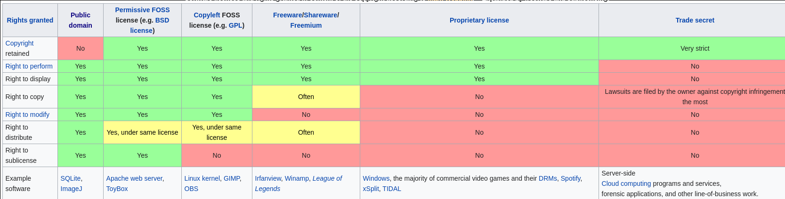

# Пакетные менеджеры и Linux дистрибутивы

Пакетные менеджеры очень сильно разрослись в последний десяток лет. Сейчас уже к
пакетам относят что угодно -- библиотеки, воспроизводимые бинарные файлы
возможно с Docker контейнерами, а также бандлы с исходными кодами
приложений. В целом всё названное по существу называется "пакетами", но мы
поговорим сегодня скорее о пакетах, которые составляют вашу операционную
систему, можно считать, что это смесь из библиотек, утилит (бинарных файлов),
которые должны работать на вашей системе или быть помощником для написания кода.
Скорее всего вы не раз использовали что-то в духе `apt`, `pacman`, `brew`,`pip`,
`conda`, `npm`. Последние три скорее созданы для определённых языков, в них идеи
очень похожи, но они по большей части ограничиваются библиотеками, которые
подцепляются в динамической линковке при запуске программ.

Конечно, вы можете сами ходить по всем своим зависимостям, их обновлять,
проверять, что ничего не ломается, но, к сожалению, такой процесс нерасширяем,
да и входной порог достаточно большой, что всё только усложняет использование
Linux. Пакетные менеджеры по своей сути помогают вам расправляться с
зависимостями, держать в курсе, что какие-то версии несовместимы, позволяют
откатывать версии назад, если что-то пошло не так. Они также вам предоставляют
поиск по пакетам, самые свежие версии пакетов, загрузку своих, уровни доверия и
важности к ним, помогают очищать граф зависимостей, если какие-то пакеты в
ацикличном графе зависимостей стали никому не нужны и ни с кем не соединены.
Менеджеры -- ваш первый спутник по установке программ, так как уже много
пользователей скорее всего проверили, что они работают на конфигурации, которую
вы имеете (ну или хотя бы приблизительную конфигурацию).

Как я уже писал выше, достаточно много пакетных менеджеров являются _языковыми_,
то есть они предназначены для расправления с зависимостями для сбора и запуска
программ. Они работают по принципу SemVer, который мы разбирали на [прошлой лекции](../build_systems).
Они похожи на сборку вашего приложения, с менеджментом зависимостей
определённых версий. Рассмотрим на примере языка Python, как они подключаются:

```python
import sys
print(sys.modules)
# ... Many packages
```

Так вы можете узнать какие пакеты подключены к текущей программе. Там будут
как и `.py` файлы, так и `.so` файлы, последние скорее всего
предкомпилированные модули, например, NumPy очень любит такое, это позволяет
Python быть быстрым в низкоуровневых вещах, например, использование
векторизованных вычислений из NumPy.

Попробуем что-нибудь устатовить и подключить:

```console
# pip install grpcio
```

```python
import grpc
import sys
print(sys.modules)
# ... Теперь тут есть grpc модули и python может делать lookup по нужным
# функциям
```

Также как и в shell, python имеет пути для поиска тех или иных модулей,
например, на моей системе оно выглядит примерно так:

```python
print(sys.path)
>>> ['', '/usr/lib/python38.zip',
     '/usr/lib/python3.8', '/usr/lib/python3.8/lib-dynload',
     '/usr/lib/python3.8/site-packages']
```

Если мы посмотрим, откуда взялся `grpc`, мы можем это найти в `site-packages`,
там есть два пакета -- `grpc` и `grpcio-*.dist-info`, первое является самим
пакетом, другой его метаданными, которые обновляются при обновлении. Там есть
интересный файл под названием `METADATA`, вот его первые строки:

```
grpcio-1.31.0.dist-info ) cat METADATA
Metadata-Version: 2.1
Name: grpcio
Version: 1.31.0
Summary: HTTP/2-based RPC framework
Home-page: https://grpc.io
Author: The gRPC Authors
Author-email: grpc-io@googlegroups.com
License: Apache License 2.0
Platform: UNKNOWN
Classifier: Development Status :: 5 - Production/Stable
Classifier: Programming Language :: Python
Classifier: Programming Language :: Python :: 2
Classifier: Programming Language :: Python :: 2.7
Classifier: Programming Language :: Python :: 3
Classifier: Programming Language :: Python :: 3.5
Classifier: Programming Language :: Python :: 3.6
Classifier: Programming Language :: Python :: 3.7
Classifier: Programming Language :: Python :: 3.8
Classifier: License :: OSI Approved :: Apache Software License
Requires-Dist: six (>=1.5.2)
Requires-Dist: futures (>=2.2.0) ; python_version < "3.2"
Requires-Dist: enum34 (>=1.0.4) ; python_version < "3.4"
Provides-Extra: protobuf
Requires-Dist: grpcio-tools (>=1.31.0) ; extra == 'protobuf'
```

Здесь как раз указано какие версии поддерживаются, какие зависимости нужны,
дальше просто README, если что-то пошло не так.

Поэтому с обновлением python с 2 до 3 версии рекомендуется снести большую часть
пакетов, установить по умолчанию 3-й и установить все пакеты обратно. К
сожалению, скорее всего у вас это не получится, так как не все пакеты
мигрировали, да и python стал критической зависимостью Linux, что тоже осложняет
переход мажорных версий.

Файл `RECORD` хранит всю метаинформацию для сверки при загрузке пакета, чтобы
если возникла ошибка, то вы могли перезагрузить пакет.

В целом, хорошей практикой является не называть пакеты одинаково для мажорных
версий, или называть их `library-1`, `library-2`, etc, когда они переходят на
множество версий. Или языки стараются включать собранную версию в сами
библиотеки, например, Rust с лёгкостью обходит ограничение на изменение мажорных
версий -- при resolve функции он будет учитывать, какая версия была подключена,
тем самым унося всю информацию о вызовах функций или классов в рантайм, добавив,
не более 4 байт на резолюцию, но об оптимизациях Rust мы не собирались говорить
сегодня.

# apt, pacman, brew, yum, etc

`apt` (Advanced Package Tool) -- один из самых популярных пакетных менеджеров
на дистрибутивах Debian и Ubuntu. Он работает по тем же принципам, что и
языковые, семантика поддержки версий там примерно такая же.

Все такие пакеты в своём фундаменте имеют свой собственный лист исходников. Apt
хранит его в `/etc/apt/sources.list`. Его содержание может быть примерно таким:

```
# sources.list
#deb cdrom:[Ubuntu 13.10 _Saucy Salamander_ - Release i386 (20131016.1)]/ saucy main restricted

# See http://help.ubuntu.com/community/UpgradeNotes for how to upgrade to
# newer versions of the distribution.
deb http://ch.archive.ubuntu.com/ubuntu/ saucy main restricted
deb-src http://ch.archive.ubuntu.com/ubuntu/ saucy main restricted
#...
```

Читать это стоит так:

* deb: Собранные бинари и библиотеки.
* deb-src: Исходный код. Полезно бывает в разработке.
* http://archive.ubuntu.com/ubuntu: URI для установки этих пакетов, весь
список официально поддерживаемых можно посмотреть [тут](https://launchpad.net/ubuntu/+archivemirrors),
обычно при установке системы выбираются близкие к вам по локации URI.
* __saucy__: Название вашего дистрибутива (saucy это 13.10)
* __main & restricted__ названия секций. Почти всегда должны присутствовать обе.

Далее при установке пакета будет смотреться этот список в порядке очереди,
искаться пакет и загружаться вместе со всеми зависимостями. Добавлять в свой
список можно и скорее будет когда-то нужно (если пакет редкий) через команды
`deb` и `deb-src`. Не забудьте после этого сделать `$ sudo apt-get update`,
чтобы новые репозитории подхватились. Вы также можете добавлять собственные
PPA (Personal Package Archive) репозитории через команду `add-apt-repository`,
подробнее можно прочитать в `$ man add-apt-repository`.

Далее существует несколько команд `apt`, `apt-get`, `apt-cache`, `apt-config`.
Просто `apt` намерен заменить все следующие для более простой процедуры.
Основные команды после `apt` следующие:

* list: показ всех пакетов, может быть использована с флагами `--installed` или
`--upgradable`.
* search: поиск по пакетам, после команды можно указывать ключевые слова.
* show: record и информация по пакету, в том числе и версии
* update: обновление версий пакетов (но не сами пакеты), иногда называют
обновление индексов пакетов
* install, remove: установка, удаление
* upgrade: обновление уже самих пакетов после `update`
* full-upgrade: полный апдейт системы, например, увеличилась версия Ubuntu,
может удалять пакеты, если они становятся несовместимыми, делайте на свой страх
и риск
* edit-sources: редактирование sources.list
* autoremove: удаление всех библиотек, которые не являются ничьими зависимостями

Установка происходит в одну из системных папок `$PATH`, например, под
`/usr/local/bin`, поэтому почти все команды требуют `sudo` для выполнения
операций.

Также вот вам инструкция, если пошло что-то не так после обновления:

* Когда совсем всё плохо, нажимаем `Ctrl+Alt+F1`, это откроет вам окно.
* Удаляем пакет, который вызвал поломку
* Если поломку вызвал upgrade пакета, то используем `apt-show` и обновляемся
обратно
* Если поломка вызвана upgrade большого количества пакетов, читаем эту
[инструкцию](https://unix.stackexchange.com/questions/79050/can-i-rollback-an-apt-get-upgrade-if-something-goes-wrong)
-- советую установить всем, потому что `apt` не поддерживает нормального
обновления на предыдущую версию в отличие от `pacman`.
* `Ctrl+Alt+F7`, чтобы выйти или `sudo reboot`, если надо перезапустить
ядро

Остальные дистрибутивы устроены очень похожим образом, например, `pacman`
имеет умную сортировку в при поиске пакетов, которая показывает наиболее
популярные пакеты сверху, `brew` является менее OS специфичным и более для
пользователей (что, например, приводит к более частым падениям :-)).

В целом различные дистрибутивы Linux и Unix имеют привязку к пакетному
менеджеру -- вы, конечно, можете установить pacman на ubuntu, но
предустановленные пакеты pacman видеть не будет, а если вы их установите
второй раз, то могут начаться большие проблемы со всей системой. Поэтому стоит
всегда придерживаться одного пакетного менеджера, например,

* Ubuntu, Debian: `apt`
* Arch Linux: `pacman`
* Fedora: `yum`
* Gentoo: `portage`
* MacOS: `brew`(?) -- тут скорее из-за того, что `brew` достаточно широко
поддержан и стоит пользоваться в основном им

В частности дистрибутивы Linux тоже весьма очень интересная тема. Давайте её
обсудим:

# Дистрибутивы Linux

Существует множество дистрибутивов Linux -- вы точно не хотите устанавливать
голый Linux, в который надо ещё накачивать различные компиляторы, редакторы итд,
чтобы он работал. Дистрибутивы вам предоставляют возможность пользоваться
Linux со своими дефолтами, философией и пакетным менеджером. А также оверхедом
на исполнение, патчами ядра и так далее. Большинство из вас скорее всего имеют
Ubuntu, но если вы хотите поменять Linux для того, чтобы больше узнать про
систему, как работают внутренние компоненты, как надо разбираться в ядре и
прочее, стоит посмотреть на философию других дистрибутивов. Вокруг дистрибутивов
есть своя аудитория или, как иногда любят называть, community.

## Ubuntu

Этот дистрибутив самый популярный и, наверное, самый стабильный. Компания
Canonical предоставляет LTS (Long Term Support) каждые два года и работает над
безопасностью, стабильностью пакетов и системы с целом. Является "адептом"
свободного ПО, что бы это ни значило, когда вам это говорят.

Также Ubuntu широко поддерживается на разных платформах, как x86-64, ARM,
PowerPC и так далее.

## Arch Linux

Arch Linux придерживается пяти принципов: простота, современность, прагматизм,
центральность пользователя и универсальность. На практике это означает, что
проект пытается иметь минимальные специфические для дистрибутива изменения,
минимальные перебои с обновлениями, прагматичный выбор идеологического дизайна,
удобство для пользователя и минимальное раздувание версий.

По факту это означает, что Arch Linux не будет иметь мажорные обновления, а
обновления всего будут обратно совместимыми.

Из-за этого `pacman` намного более удобный пакетный менеджер с функциями
rollback, но в свою очередь менее "коробочный" и порой инструкции по настройке
достаточно сложны. Тем не менее, Arch Linux обожает динамические библиотеки в
угоду производительности.

Arch поддерживается официально только на процессорах x86-64.

## Fedora

Миссия Fedora примерно такая же, как и у Ubuntu, но система больше нацелена
для разработчиков -- поэтому там нет многих предустановленных приложений. Также
Fedora больше времени уделяет безопасности.

## Gentoo

Цель Gentoo -- разработка инструментов и систем, которые позволят пользователю
делать всё максимально эффективно, насколько это возможно.
Инструменты должны быть приятными в использовании и должны помочь
пользователю оценить богатство Linux и сообщества свободного программного
обеспечения. Это возможно только в том случае, если открыт исходный код. Вы
сами вольны выбирать как его собирать, а все попытки навязать тот или иной
подход противоречат этой философии.

На практике вы сами собираете весь код, никакой коробочности, максимальная
прозрачность до почти голого Linux.

# Что выбрать?

Если нравятся низкоуровненые вещи, используйте Arch Linux или Gentoo в
зависимости от того, насколько вы хотите тратить на это время. Если интересует
безопасность и простота, то Fedora ваш выбор, а если не хочется ни с чем
заморачиваться и хочется, чтобы дистрибутив просто работал, то Ubuntu будет
хорошим выбором. Также есть огромный список различных других дистрибутивов,
каждый со своими особенностями и документацией. Я лично пользуюсь уже 5 лет
Arch Linux и 2 года до этого пользовался Ubuntu, в целом остался довольным всем,
везде получил нужный и полезный опыт. Серверная часть во многих Cloud
провайдерах работает на Ubuntu из-за стабильности.

# Лицензии

Одна из важных тем, которую стоит обсудить, когда вы скачиваете или
устанавливаете тот или иной пакет -- с какой лицензией он идёт.

Это важно, потому что за лицензиями стоит порядок и законодательные
обязательства. Как бы вы ни противились бюрократии, это, к сожалению, важно.
Например, если вы публикуете какую-то библиотеку без лицензии, по-хорошему
ей можно пользоваться, но нельзя распространять или редактировать -- это
нарушение авторских прав. Всё лицензирование отличается только в аспектах
распространения, изменения



В целом любые из лицензий MIT, Apache, BSD, Boost, LLVM, GPL достаточно свободно
можно пользоваться и переиспользовать, но вы должны указывать все изменения,
если они требуются или делать отсылки к этим лицензиям, когда вы сами публикуете
эти программы. В том числе лицензирование помогает бороться с insider trading,
так, например, если вы работаете в Google или Facebook, пока вы не получите
разрешение на публикацию хоть чего-то, то гигатны могут у вас отсудить эти
права.

На лекции мы также разберём страшные случаи лицензирования, и когда это
попадало под закон и вело, например, к лишению свободы или большим штрафам.
