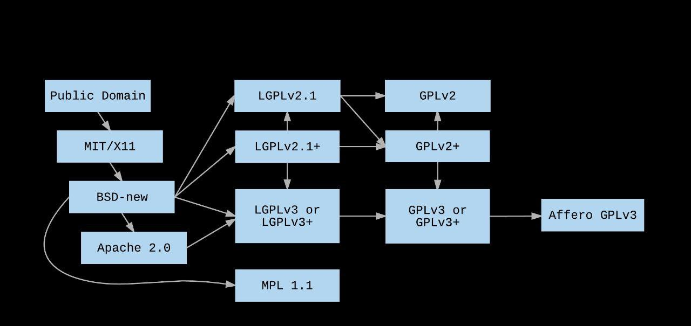

# Пакетные менеджеры и Linux дистрибутивы

Пакетные менеджеры очень сильно разрослись в последний десяток лет. Сейчас уже к
пакетам относят что угодно &mdash; библиотеки, воспроизводимые бинарные файлы
возможно с Docker контейнерами, а также бандлы с исходными кодами
приложений. В целом всё названное по существу называется "пакетами", но мы
поговорим сегодня скорее о пакетах, которые составляют Вашу операционную
систему, можно считать, что это смесь из библиотек, утилит (бинарных файлов),
которые должны работать на Вашей системе или быть помощником для написания кода.
Скорее всего Вы не раз использовали что-то в духе `apt`, `pacman`, `brew`,`pip`,
`conda`, `npm`. Последние три скорее созданы для определённых языков, в них идеи
очень похожи, но они по большей части ограничиваются библиотеками, которые
подцепляются в динамической линковке при запуске программ.

Конечно, Вы можете сами ходить по всем своим зависимостям, их обновлять,
проверять, что ничего не ломается, но, к сожалению, такой процесс нерасширяем,
да и входной порог достаточно большой, что всё только усложняет использование
Linux. Пакетные менеджеры по своей сути помогают Вам расправляться с
зависимостями, держать в курсе, что какие-то версии несовместимы, позволяют
откатывать версии назад, если что-то пошло не так. Они также Вам предоставляют
поиск по пакетам, самые свежие версии пакетов, загрузку своих, уровни доверия и
важности к ним, помогают очищать граф зависимостей, если какие-то пакеты в
ацикличном графе зависимостей стали никому не нужны и ни с кем не соединены.
Менеджеры &mdash; Ваш первый спутник по установке программ, так как уже много
пользователей скорее всего проверили, что они работают на конфигурации, которую
Вы имеете (ну или хотя бы приблизительную конфигурацию).

Как я уже писал выше, достаточно много пакетных менеджеров являются _языковыми_,
то есть они предназначены для расправления с зависимостями для сбора и запуска
программ. Они работают по принципу SemVer, который мы разбирали на [прошлой лекции](../build_systems).
Они похожи на сборку Вашего приложения, с менеджментом зависимостей
определённых версий. Рассмотрим на примере языка Python, как они подключаются:

```python
import sys
print(sys.modules)
# ... Many packages
```

Так Вы можете узнать какие пакеты подключены к текущей программе. Там будут
как и `.py` файлы, так и `.so` файлы, последние скорее всего
предкомпилированные модули, например, NumPy очень любит такое, это позволяет
Python быть быстрым в низкоуровневых вещах, например, использование
векторизованных вычислений из NumPy.

Попробуем что-нибудь устатовить и подключить:

```console
# pip install grpcio
```

```python
import grpc
import sys
print(sys.modules)
# ... Теперь тут есть grpc модули и python может делать lookup по нужным
# функциям
```

Так же как и в shell, python имеет пути для поиска тех или иных модулей,
например, на моей системе оно выглядит примерно так:

```python
print(sys.path)
>>> ['', '/usr/lib/python38.zip',
     '/usr/lib/python3.8', '/usr/lib/python3.8/lib-dynload',
     '/usr/lib/python3.8/site-packages']
```

Если мы посмотрим, откуда взялся `grpc`, мы можем это найти в `site-packages`,
там есть два пакета &mdash; `grpc` и `grpcio-*.dist-info`, первое является самим
пакетом, другой его метаданными, которые обновляются при обновлении. Там есть
интересный файл под названием `METADATA`, вот его первые строки:

```
grpcio-1.31.0.dist-info ) cat METADATA
Metadata-Version: 2.1
Name: grpcio
Version: 1.31.0
Summary: HTTP/2-based RPC framework
Home-page: https://grpc.io
Author: The gRPC Authors
Author-email: grpc-io@googlegroups.com
License: Apache License 2.0
Platform: UNKNOWN
Classifier: Development Status :: 5 - Production/Stable
Classifier: Programming Language :: Python
Classifier: Programming Language :: Python :: 2
Classifier: Programming Language :: Python :: 2.7
Classifier: Programming Language :: Python :: 3
Classifier: Programming Language :: Python :: 3.5
Classifier: Programming Language :: Python :: 3.6
Classifier: Programming Language :: Python :: 3.7
Classifier: Programming Language :: Python :: 3.8
Classifier: License :: OSI Approved :: Apache Software License
Requires-Dist: six (>=1.5.2)
Requires-Dist: futures (>=2.2.0) ; python_version < "3.2"
Requires-Dist: enum34 (>=1.0.4) ; python_version < "3.4"
Provides-Extra: protobuf
Requires-Dist: grpcio-tools (>=1.31.0) ; extra == 'protobuf'
```

Здесь как раз указано какие версии поддерживаются, какие зависимости нужны,
дальше просто README, если что-то пошло не так.

Поэтому с обновлением python с 2 до 3 версии рекомендуется снести большую часть
пакетов, установить по умолчанию 3-й и установить все пакеты обратно. К
сожалению, скорее всего у Вас это не получится, так как не все пакеты
мигрировали, да и python стал критической зависимостью Linux, что тоже осложняет
переход мажорных версий.

Файл `RECORD` хранит всю метаинформацию для сверки при загрузке пакета, чтобы
если возникла ошибка, то Вы могли перезагрузить пакет.

В целом, хорошей практикой является не называть пакеты одинаково для мажорных
версий, или называть их `library-1`, `library-2`, etc, когда они переходят на
множество версий. Или языки стараются включать собранную версию в сами
библиотеки, например, Rust с лёгкостью обходит ограничение на изменение мажорных
версий &mdash; при resolve функции он будет учитывать, какая версия была подключена,
тем самым унося всю информацию о вызовах функций или классов в рантайм, добавив,
не более 4 байт на резолюцию, но об оптимизациях Rust мы не собирались говорить
сегодня.

# apt, pacman, brew, yum, etc

`apt` (Advanced Package Tool) &mdash; один из самых популярных пакетных менеджеров
на дистрибутивах Debian и Ubuntu. Он работает по тем же принципам, что и
языковые, семантика поддержки версий там примерно такая же.

Все такие пакеты в своём фундаменте имеют свой собственный лист исходников. Apt
хранит его в `/etc/apt/sources.list`. Его содержание может быть примерно таким:

```
# sources.list
#deb cdrom:[Ubuntu 13.10 _Saucy Salamander_ - Release i386 (20131016.1)]/ saucy main restricted

# See http://help.ubuntu.com/community/UpgradeNotes for how to upgrade to
# newer versions of the distribution.
deb http://ch.archive.ubuntu.com/ubuntu/ saucy main restricted
deb-src http://ch.archive.ubuntu.com/ubuntu/ saucy main restricted
#...
```

Читать это стоит так:

* deb: Собранные бинари и библиотеки.
* deb-src: Исходный код. Полезно бывает в разработке.
* http://archive.ubuntu.com/ubuntu: URI для установки этих пакетов, весь
список официально поддерживаемых можно посмотреть [тут](https://launchpad.net/ubuntu/+archivemirrors),
обычно при установке системы выбираются близкие к Вам по локации URI.
* __saucy__: Название Вашего дистрибутива (saucy это 13.10)
* __main & restricted__ названия секций. Почти всегда должны присутствовать обе.

Далее при установке пакета будет смотреться этот список в порядке очереди,
искаться пакет и загружаться вместе со всеми зависимостями. Добавлять в свой
список можно и скорее будет когда-то нужно (если пакет редкий) через команды
`deb` и `deb-src`. Не забудьте после этого сделать `$ sudo apt-get update`,
чтобы новые репозитории подхватились. Вы также можете добавлять собственные
PPA (Personal Package Archive) репозитории через команду `add-apt-repository`,
подробнее можно прочитать в `$ man add-apt-repository`.

Далее существует несколько команд `apt`, `apt-get`, `apt-cache`, `apt-config`.
Просто `apt` намерен заменить все следующие для более простой процедуры.
Основные команды после `apt` следующие:

* list: показ всех пакетов, может быть использована с флагами `--installed` или
`--upgradable`.
* search: поиск по пакетам, после команды можно указывать ключевые слова.
* show: record и информация по пакету, в том числе и версии
* update: обновление версий пакетов (но не сами пакеты), иногда называют
обновление индексов пакетов
* install, remove: установка, удаление
* upgrade: обновление уже самих пакетов после `update`
* full-upgrade: полный апдейт системы, например, увеличилась версия Ubuntu,
может удалять пакеты, если они становятся несовместимыми, делайте на свой страх
и риск
* edit-sources: редактирование sources.list
* autoremove: удаление всех библиотек, которые не являются ничьими зависимостями

Установка происходит в одну из системных папок `$PATH`, например, под
`/usr/local/bin`, поэтому почти все команды требуют `sudo` для выполнения
операций.

Также вот Вам инструкция, если пошло что-то не так после обновления:

* Когда совсем всё плохо, нажимаем `Ctrl+Alt+F1`, это откроет Вам окно.
* Удаляем пакет, который вызвал поломку
* Если поломку вызвал upgrade пакета, то используем `apt-show` и обновляемся
обратно
* Если поломка вызвана upgrade большого количества пакетов, читаем эту
[инструкцию](https://unix.stackexchange.com/questions/79050/can-i-rollback-an-apt-get-upgrade-if-something-goes-wrong)
&mdash; советую установить всем, потому что `apt` не поддерживает нормального
обновления на предыдущую версию в отличие от `pacman`.
* `Ctrl+Alt+F7`, чтобы выйти или `sudo reboot`, если надо перезапустить
ядро

Остальные дистрибутивы устроены очень похожим образом, например, `pacman`
имеет умную сортировку в при поиске пакетов, которая показывает наиболее
популярные пакеты сверху, `brew` является менее OS специфичным и более для
пользователей (что, например, приводит к более частым падениям :-)).

В целом различные дистрибутивы Linux и Unix имеют привязку к пакетному
менеджеру &mdash; Вы, конечно, можете установить pacman на ubuntu, но
предустановленные пакеты pacman видеть не будет, а если Вы их установите
второй раз, то могут начаться большие проблемы со всей системой. Поэтому стоит
всегда придерживаться одного пакетного менеджера, например,

* Ubuntu, Debian: `apt`
* Arch Linux: `pacman`
* Fedora: `yum`
* Gentoo: `portage`
* MacOS: `brew`(?) &mdash; тут скорее из-за того, что `brew` достаточно широко
поддержан и стоит пользоваться в основном им

В частности дистрибутивы Linux тоже весьма очень интересная тема. Давайте её
обсудим:

# Дистрибутивы Linux

Существует множество дистрибутивов Linux &mdash; Вы точно не хотите устанавливать
голый Linux, в который надо ещё накачивать различные компиляторы, редакторы итд,
чтобы он работал. Дистрибутивы Вам предоставляют возможность пользоваться
Linux со своими дефолтами, философией и пакетным менеджером. А также оверхедом
на исполнение, патчами ядра и так далее. Большинство из Вас скорее всего имеют
Ubuntu, но если Вы хотите поменять Linux для того, чтобы больше узнать про
систему, как работают внутренние компоненты, как надо разбираться в ядре и
прочее, стоит посмотреть на философию других дистрибутивов. Вокруг дистрибутивов
есть своя аудитория или, как иногда любят называть, community.

## Ubuntu

Этот дистрибутив самый популярный и, наверное, самый стабильный. Компания
Canonical предоставляет LTS (Long Term Support) каждые два года и работает над
безопасностью, стабильностью пакетов и системы с целом. Является "адептом"
свободного ПО, что бы это ни значило, когда Вам это говорят.

Также Ubuntu широко поддерживается на разных платформах, как x86-64, ARM,
PowerPC и так далее.

## Arch Linux

Arch Linux придерживается пяти принципов: простота, современность, прагматизм,
центральность пользователя и универсальность. На практике это означает, что
проект пытается иметь минимальные специфические для дистрибутива изменения,
минимальные перебои с обновлениями, прагматичный выбор идеологического дизайна,
удобство для пользователя и минимальное раздувание версий.

По факту это означает, что Arch Linux не будет иметь мажорные обновления, а
обновления всего будут обратно совместимыми.

Из-за этого `pacman` намного более удобный пакетный менеджер с функциями
rollback, но в свою очередь менее "коробочный" и порой инструкции по настройке
достаточно сложны. Тем не менее, Arch Linux обожает динамические библиотеки в
угоду производительности.

Arch поддерживается официально только на процессорах x86-64.

## Fedora

Миссия Fedora примерно такая же, как и у Ubuntu, но система больше нацелена
для разработчиков &mdash; поэтому там нет многих предустановленных приложений. Также
Fedora больше времени уделяет безопасности.

## Gentoo

Цель Gentoo &mdash; разработка инструментов и систем, которые позволят пользователю
делать всё максимально эффективно, насколько это возможно.
Инструменты должны быть приятными в использовании и должны помочь
пользователю оценить богатство Linux и сообщества свободного программного
обеспечения. Это возможно только в том случае, если открыт исходный код. Вы
сами вольны выбирать как его собирать, а все попытки навязать тот или иной
подход противоречат этой философии.

На практике Вы сами собираете весь код, никакой коробочности, максимальная
прозрачность до почти голого Linux.

# Что выбрать?

Если нравятся низкоуровненые вещи, используйте Arch Linux или Gentoo в
зависимости от того, насколько Вы хотите тратить на это время. Если интересует
безопасность и простота, то Fedora Ваш выбор, а если не хочется ни с чем
заморачиваться и хочется, чтобы дистрибутив просто работал, то Ubuntu будет
хорошим выбором. Также есть огромный список различных других дистрибутивов,
каждый со своими особенностями и документацией. Я лично пользуюсь уже 5 лет
Arch Linux и 2 года до этого пользовался Ubuntu, в целом остался довольным всем,
везде получил нужный и полезный опыт. Серверная часть во многих Cloud
провайдерах работает на Ubuntu из-за стабильности.

# Лицензии

Одна из важных тем, которую стоит обсудить, когда Вы скачиваете или
устанавливаете тот или иной пакет &mdash; с какой лицензией он идёт.

Это важно, потому что за лицензиями стоит порядок и законодательные
обязательства. Как бы Вы ни противились бюрократии, это, к сожалению, важно.
Например, если Вы публикуете какую-то библиотеку без лицензии, по-хорошему
ей можно пользоваться, но нельзя распространять или редактировать &mdash; это
нарушение авторских прав. Всё лицензирование отличается только в аспектах
распространения, изменения, упоминания автора, упоминания лицензии.
[Здесь](https://opensource.org/osd) можно прочитать, что делает любую лицензию
open source.

Самое главное, Вы можете распространять свой код под любой лицензией, которой
Вы напишите. Как уже писалось выше, чтобы оно имело юридическую силу, надо,
чтобы в ней были указаны основные [аспекты](https://opensource.org/osd).
Не все пользуются популярными решениями и в праве писать свои лицензии. Так
делает, например, curl:

```
COPYRIGHT AND PERMISSION NOTICE

Copyright (c) 1996 - 2021, Daniel Stenberg, daniel@haxx.se, and many contributors, see the THANKS file.

All rights reserved.

Permission to use, copy, modify, and distribute this software for any purpose with or without fee is hereby granted, provided that the above copyright notice and this permission notice appear in all copies.

THE SOFTWARE IS PROVIDED "AS IS", WITHOUT WARRANTY OF ANY KIND, EXPRESS OR IMPLIED, INCLUDING BUT NOT LIMITED TO THE WARRANTIES OF MERCHANTABILITY, FITNESS FOR A PARTICULAR PURPOSE AND NONINFRINGEMENT OF THIRD PARTY RIGHTS. IN NO EVENT SHALL THE AUTHORS OR COPYRIGHT HOLDERS BE LIABLE FOR ANY CLAIM, DAMAGES OR OTHER LIABILITY, WHETHER IN AN ACTION OF CONTRACT, TORT OR OTHERWISE, ARISING FROM, OUT OF OR IN CONNECTION WITH THE SOFTWARE OR THE USE OR OTHER DEALINGS IN THE SOFTWARE.

Except as contained in this notice, the name of a copyright holder shall not be used in advertising or otherwise to promote the sale, use or other dealings in this Software without prior written authorization of the copyright holder.
```

Как видно, библиотеку можно использовать как угодно и где угодно, правда придётся
включать лицензию, если Вы распространяйте своё ПО. Например, у автора curl есть
даже [коллекция](https://daniel.haxx.se/blog/2016/10/03/screenshotted-curl-credits/)
того, где используется curl. Спойлер: там от рандомных embedded систем до
GTA V и остальных.

Иногда Вы можете встречать понятие _Public domain_, в основном это лицензии или
полный отказ от копирайта. Если говорить строго, такие репозитории не имеют
юридическую силу при использовании и по-хорошему ими пользоваться нельзя.

Иногда Вы можете встретить _Do the fuck you want_ лицензию, она тоже не является
копирайтом. Если автор говорит, что вы можете «делать все, что хотите», это не
лицензия на авторское право. Вам следует избегать использования этого кода.
Проблема в намерениях. Имеет ли автор в виду "сделать что угодно", чтобы
включить право воспроизведения? Право распространять? Также не ясно, является ли
это преднамеренным и явным отказом от общественного достояния. Это чисто
бюрократически правовой вопрос.

Предпочитайте найти правильно лицензированную библиотеку или
переписать код с нуля. Проблема в неоднозначности лицензии, а также её
намерениях.

В идеальном бюрократическом мире весь код должен быть под какой-то лицензией.
Например, даже код со StackOverflow является [лицензируемым](https://stackoverflow.com/help/licensing)
под CC BY-SA (Creative Commons with Attribution and Free Share), например, Вы
должны указывать откуда Вы скопипастили код, какие изменения сделали, а если Вы
решили улучшить функциональность этого и выложить, то лицензия должна быть та
же.

Я лично разделяю на несколько пунктов лицензии:

1. Если лицензия приватная, то все права защищены и этим пользоваться для своего
   бизнеса нельзя, если не сказано иначе. Вы пользователь, а программа закрыта.
   Например, это порождает споры, а разрешено ли делать reserve engineering,
   например, George Hotz попадал несколько раз в [разбирательства](https://en.wikipedia.org/wiki/George_Hotz)
   из-за jailbreak iPhone. Сейчас существуют отдельные bug bounty, чтобы такого
   больше не возникало.
2. Если лицензия публичная, то я разделяю их в основном на 3 вида:

## Ограниченные

Лицензии в этой категории требуют обязательного распространения исходного кода.
Например, если Вы хотите подзаработать денег с использованием этих программ в
Вашем коде, то надо будет выложить в открытый доступ по любому запросу.

Вот примерный их список:

Популярные:

*   [GNU GPL v1, v2, v3](http://opensource.org/licenses/gpl-license.php)
*   [GNU LGPL v2, v2.1, v3](http://opensource.org/licenses/lgpl-license.php)
    (LGPL-licensed components can be used without
    observing all of the restricted-type requirements if the component is
    dynamically-linked).

Не очень:

*   [BCL](http://www.oracle.com/technetwork/java/javase/terms/license/index.html)
*   [CERN Open Hardware License 2 - Strongly Reciprocal Variant](https://ohwr.org/cern_ohl_s_v2.txt)
*   [Creative Commons "Attribution-ShareAlike" (CC BY-SA)](http://creativecommons.org/licenses/)
*   [GNU Classpath's GPL + exception](http://www.gnu.org/software/classpath/license.html)
*   [Nethack General Public License](https://opensource.org/licenses/NGPL)
*   Netscape Public License [NPL 1.0](http://www.mozilla.org/MPL/NPL/1.0/) and
    [NPL 1.1](http://www.mozilla.org/MPL/NPL/1.1/)
*   [OSL](http://opensource.org/licenses/osl-2.1.php)
*   [QPL](http://opensource.org/licenses/qtpl.php)
*   [Sleepycat License](http://opensource.org/licenses/sleepycat.php)
*   [TAPR Open Hardware License](https://web.tapr.org/TAPR_Open_Hardware_License_v1.0.txt)
*   [qmail Terms of Distribution](http://cr.yp.to/qmail/dist.html)

Примеры: [Linux](https://tldp.org/FAQ/Linux-FAQ/general.html), но учитывайте,
что работать на системе и использовать код это разные вещи, Вы можете
пользоваться продуктом для написания своего. [GMP](https://gmplib.org/)
библиотека для длинной арифметики, [GCC](https://gcc.gnu.org/), всем известный
Вам компилятор. В основном все проекты под иерархии GNU будут лицензированы под
GPL или в лучшем случае про LGPL, когда можно линковаться динамически с
библиотекой без изменений.

## Reciprocal (не знаю хорошего перевода)

В этом случае такие же условия, только обязательная публикация измененного кода
самой зависимости, но не обязательно всего кода и всей Вашей бизнес логики.
Примеры таких лицензий достаточно редки, тем не менее, встречаются.

*   [CERN Open Hardware License 1.2](https://ohwr.org/project/cernohl/wikis/Documents/CERN-OHL-version-1.2)
*   [CERN Open Hardware License 2 - Weakly Reciprocal Variant](https://ohwr.org/cern_ohl_w_v2.txt)
*   Common Development and Distribution License
    [CDDL 1.0](http://opensource.org/licenses/cddl1.php),
    [CDDL 1.1](https://glassfish.java.net/public/CDDL+GPL_1_1.html)
*   [CeCILL-C License](http://www.cecill.info/licences/Licence_CeCILL-C_V1-en.html)
*   [CPL 1.0](http://opensource.org/licenses/cpl1.0.php)
*   [EPL 1.0](http://opensource.org/licenses/eclipse-1.0.php) and
    [EPL 2.0](https://opensource.org/licenses/EPL-2.0) (Eclipse Public License)
*   [IPL 1.0](http://opensource.org/licenses/ibmpl.php) (IBM Public License)
*   Mozilla Public License
    [MPL 1.0](http://opensource.org/licenses/mozilla1.0.php),
    [MPL 1.1](http://opensource.org/licenses/mozilla1.1.php), and
    [MPL 2.0](http://opensource.org/licenses/MPL-2.0)
*   [Apple Public Source License (APSL) 1.1](http://spdx.org/licenses/APSL-1.1.html)
*   [Apple Public Source License (APSL) 2.0](http://opensource.org/licenses/apsl-2.0.php)
*   [Ruby](http://www.ruby-lang.org/en/about/license.txt)

## Уведомляющие лицензии

Это самые часто встречающиеся лицензии, сюда входят MIT, BSD, BSL, Apache, Boost,
CC BY и тому подобные. В данном случае они разрешены для любого
коммерческого использования. Отличия в том, можно ли перелицензировать, нужно
ли просто предоставлять копию лицензии с копией ПО и тому подобное. Я думаю,
ниже список охватывающий большинство лицензий, которые существуют. Из примеров
этот репозиторий распространяется под MIT, Wikipedia и StackOverflow под
CC BY-SA.

Популярные:

*   [MIT/X11/Expat](http://opensource.org/licenses/mit-license.php)
*   [Apache License 2.0](http://apache.org/licenses/LICENSE-2.0)
*   [BSD 3-clause (sometimes called BSD-new)](https://opensource.org/licenses/BSD-3-Clause)
*   [Creative Commons "Attribution" (CC BY) license](http://creativecommons.org/licenses/)
*   [zlib/libpng](http://opensource.org/licenses/zlib-license.php)
*   [PostgreSQL License](https://www.postgresql.org/about/licence/)
*   [Python Software Foundation](http://www.python.org/download/releases/2.3.2/license/)
*   [Microsoft Public License (MS-PL)](http://opensource.org/licenses/MS-PL)

Не очень:

*   Academic Free License:
    [AFL 2.1](http://web.archive.org/web/20060428203736/http://opensource.org/licenses/afl-2.1.php)
    and [AFL 3.0](http://opensource.org/licenses/AFL-3.0)
*   Academy of Motion Picture Arts and Sciences BSD or
    [A.M.P.A.S](https://spdx.org/licenses/AMPAS.html)
*   [Artistic License 1.0](http://opensource.org/licenses/artistic-license-1.0)
    and
    [Artistic License 2.0](http://opensource.org/licenses/artistic-license-2.0)
*   [ASL 1.1](http://apache.org/licenses/LICENSE-1.1) (Apache Software License
    1.1)
*   [Autodesk DWF Toolkit](http://usa.autodesk.com/adsk/servlet/item?siteID=123112&id=5522878)
*   [Boost Software License](http://www.boost.org/users/license.html)
*   [BSD (occasionally referred to as the "University of California" license)](https://opensource.org/licenses/bsd-license.php)
*   [BSD + Patent](https://opensource.org/licenses/BSDplusPatent)
*   [BSD - AES variant](https://web.archive.org/web/20190806093009/https://fedoraproject.org/wiki/Licensing:BSD#AES_Variant)
*   [CERN Geant4 License v1.0/Geant4](https://raw.githubusercontent.com/Geant4/geant4/geant4-10.6-release/LICENSE)
*   [CERN Open Hardware License 2 - Permissive Variant](https://ohwr.org/cern_ohl_p_v2.txt)
*   [JSON License](https://raw.githubusercontent.com/douglascrockford/JSMin/1bf6ce5f74a9f8752ac7f5d115b8d7ccb31cfe1b/jsmin.c)
    (MIT license with the added note: "The Software shall be used for Good, not
    Evil.")
*   [Eclipse Distribution License (BSD variant)](https://www.eclipse.org/org/documents/edl-v10.php)
*   [FreeType Project License](http://freetype.sourceforge.net/FTL.TXT)
*   [Historical Permission Notice and Disclaimer](https://opensource.org/licenses/HPND)
*   [ImageMagick License](http://imagemagick.org/script/license.php)
*   [ISC License](http://opensource.org/licenses/ISC)
*   [libjpeg-turbo](http://bazaar.launchpad.net/~tom-gall/libjpeg-turbo/trunk/view/1/README)
*   [LibTIFF](http://www.remotesensing.org/libtiff/misc.html)
*   [Lucent Public License 1.02 (used by Plan 9 now, but different from "the
    Plan 9 license")](http://cm.bell-labs.com/plan9/license.html)
*   [MIT adapted by CMU](https://web.archive.org/web/20190922104304/https://fedoraproject.org/wiki/Licensing:MIT?rd=Licensing/MIT#CMU_Style)
*   [NCSA](http://opensource.org/licenses/UoI-NCSA.php)
*   [National Institute of Standards and Technology (NIST) Software License](https://www.nist.gov/topics/data/public-access-nist-research/copyright-fair-use-and-licensing-statements-srd-data-and#software)
*   [OpenSSL](http://www.openssl.org/source/license.html)
*   [PHP License 2.02](http://www.php.net/license/2_02.txt) and
    [3.0](http://www.php.net/license/3_0.txt)
*   [Python Imaging Library (PIL) License](https://web.archive.org/web/20190921164759/http://www.pythonware.com/products/pil/license.htm)
*   [Solderpad Hardware License](https://solderpad.org/licenses/)
*   [STLport License](https://web.archive.org/web/20190804123932/http://www.stlport.org/doc/license.html)
*   [TCP Wrappers](http://ftp.porcupine.org/pub/security/tcp_wrappers_license)
*   [Unicode, Inc. License Agreement - Data Files and Software](http://www.unicode.org/copyright.html#Exhibit1)
*   [Universal Permissive License (UPL), Version 1.0](http://opensource.org/licenses/UPL)
*   [W3C Software license](http://opensource.org/licenses/W3C.php)
*   [X.Net](http://opensource.org/licenses/xnet.php)
*   [Zend Engine License, v2.00](http://www.zend.com/license/2_00.txt)
*   [ZPL](http://opensource.org/licenses/zpl.php)

Лицензии, которые Вы будете встречать чаще всего в open source:

*   [MIT/X11/Expat](http://opensource.org/licenses/mit-license.php)
*   [GNU GPL v1, v2, v3](http://opensource.org/licenses/gpl-license.php)
*   [GNU LGPL v2, v2.1, v3](http://opensource.org/licenses/lgpl-license.php)
    (LGPL-licensed components can be used without
    observing all of the restricted-type requirements if the component is
    dynamically-linked).
*   [BSD 3-clause (sometimes called BSD-new)](https://opensource.org/licenses/BSD-3-Clause)
*   [Apache License 2.0](http://apache.org/licenses/LICENSE-2.0)
*   [Creative Commons "Attribution" (CC BY) license](http://creativecommons.org/licenses/)

Некоторые компании захотят подзаработать, как решила сделать MongoDB в один
момент и тогда возможно Вы сможете встретить [AGPL](https://www.gnu.org/licenses/agpl-3.0.html) или
[CC BY-NC-\*](http://creativecommons.org/licenses/) (Non-Commercial Use). Это
скорее палки в колёса, чтобы другие не зарабатывали на этом.

Вот простой неполный граф самых простых лицензий, кого и куда можно включать
без угрызения совести, но придётся выбирать самую узкую лицензию:



В целом любые из лицензий MIT, Apache, BSD, CC BY достаточно свободно
можно пользоваться и переиспользовать, но Вы должны указывать все изменения,
если они требуются или делать отсылки к этим лицензиям/авторам, когда Вы сами
публикуете библиотеки/программы на основе других библиотек.

На лекции мы посмотрели на пример
[ClickHouse](https://github.com/ClickHouse/ClickHouse/blob/9291bbb04bf7b6d1ae27098765a801ae6895e9f4/docs/en/development/contrib.md) и какие
лицензии используют third party библиотеки.

Лицензии в основном находятся в файле LICENSE, уведомления в файле NOTICE,
иногда права пишут ещё отдельно в COPYING, а всех контрибьютеров в CONTRIBUTORS.

__Дисклеймер: я не юрист и всё выше сказанное не несёт в себе совета или силы,
а лишь рассказывает моё понимание как лицензии устроены. Если Вы хотите точно
знать последствия Ваших действий, проконсультируйтесь с профессионалом.__
